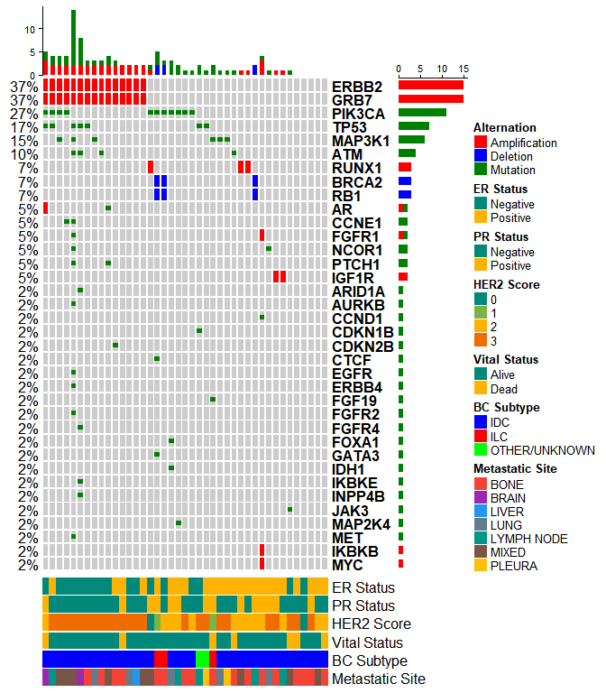
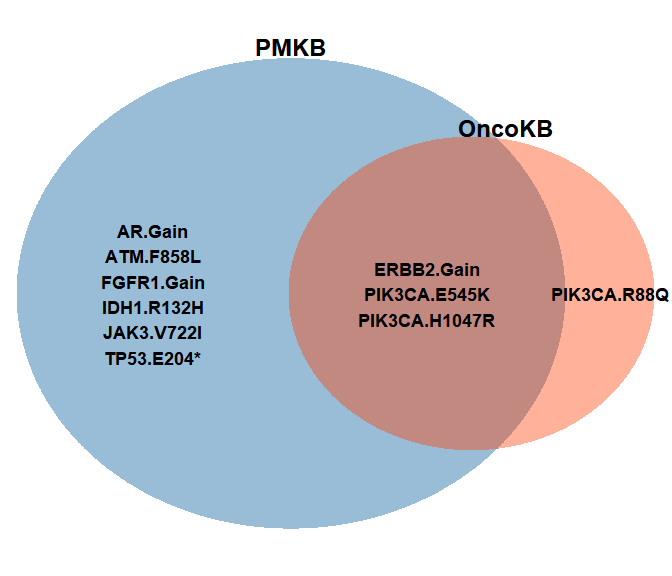
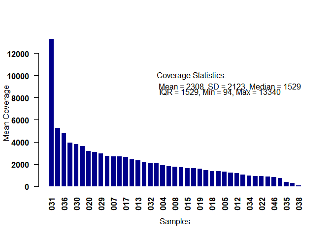
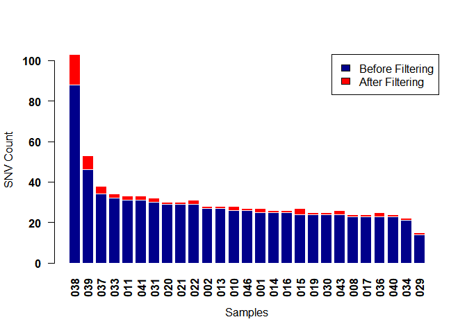
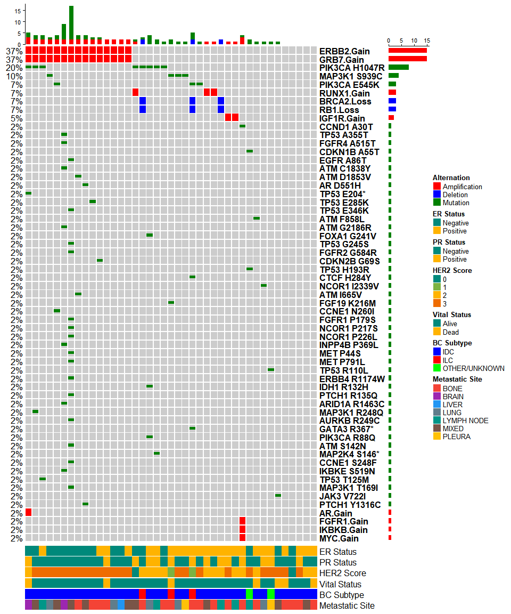

[Github.io page](https://osamashiraz.github.io/Turkish-BC-Study/)

main.RMD contains the code used to generate data presented in following
work: (Identifying Genomic Alterations in Stage IV Breast Cancer
Patients using MammaSeq<sup>TM</sup>: An International Collaborative
Study)\[<a href="https://www.sciencedirect.com/science/article/abs/pii/S1526820920302135" class="uri">https://www.sciencedirect.com/science/article/abs/pii/S1526820920302135</a>\]

PREPARATION
===========

``` r
# WORKING DIRECTORY TO LOCATION OF SCRIPT - MUST HAVE INPUT AND OUT FOLDER (MIRROR FROM )
setwd("./")

# SET INPUT AND OUTPUT PATHS
inputFilePath = "./input/"
outputFilePath = "./out/"


# LOAD PACKAGES
library(reshape2)


# LOAD DATA
load(paste0(inputFilePath, "CRAVAT.annotated.SNVs.rda")) # CRAVAT ANNOTATED SNV DATA
load(paste0(inputFilePath, "clinical.data.final.rda")) # CLINICAL DATA
load(paste0(inputFilePath, "oncokb.Rdata")) # ONCOKB DB
load(paste0(inputFilePath, "cnv.data.rda")) # CNV DATA
load(paste0(inputFilePath, "PMKB.rda")) # PMKB DB
load(paste0(inputFilePath, "colorPalette.rda")) # ANNOTATION COLORS
```

SNV FILTERING
=============

``` r
# FILTER 1: REMOVE GENOMIC VARIANTS THAT ARE PRESENT IN 30% OR MORE SAMPLES (LIKELY TO BE SEQUENCING ARTIFACTS OR COMMON VARIATIONS)
mamma.filter.1=Mamma[Mamma$Position %in% names(which(table(Mamma$Position) < length(unique(Mamma$Sample.ID))*30/100)),]

# FILTER 2: REMOVE ALL SYNONYMOUS VARIANTS (SY)
mamma.filter.2=mamma.filter.1[-grep('SY',mamma.filter.1$Sequence.ontology),]

# FILTER 3: REMOVE LOW CONFIDENCE VARIANTS (SELECT FOR VARIANTS WITH STRAND BIAS BETWEEN 0.5 and 0.6)
lb = summary(mamma.filter.2$STB)[2]; ub = summary(mamma.filter.2$STB)[5] # STB FORMULA: READS IN FORWARD STRAND / (READS IN FORWARD STRAND + READS IN REVERSE STRAND), 0.6 >= x >= 0.5 
                                                                         # MEANS WE DISREGARD REGIONS WHERE REVERSE STRAND READS ARE HIGHER THAN FORWARD 
                                                                         # BUT WE INCLUDE VARIANTS IF THE FOWARD STRAND READS ARE LITTLE BITT MORE THAN REVERSE ONES, REASONING
mamma.filter.3=mamma.filter.2[mamma.filter.2$STB >= lb & mamma.filter.2$STB <= ub, ]

# FILTER 4: REMOVE VARIANTS ANNOTATED IN GNOMAD AND 1000GENOME WITH AF >= 1%
mamma.filter.3$gnomAD.AF.Total=as.numeric(mamma.filter.3$gnomAD.AF.Total); mamma.filter.3$X1000.Genomes.AF=as.numeric(mamma.filter.3$X1000.Genomes.AF)
mamma.filter.4=mamma.filter.3[mamma.filter.3$gnomAD.AF.Total < 0.01 | mamma.filter.3$X1000.Genomes.AF < 0.01, ]

# FILTER 5: REMOVE VARIANTS WITH AF > 90%, THESE ARE LIKELY GERMLINE
mamma.filter.4$AF=as.numeric(mamma.filter.4$AF)
mamma.filter.5=mamma.filter.4[mamma.filter.4$AF < 0.9, ]

# FILTER 6: READ DEPTH
mamma.final=subset(mamma.filter.5, Total.reads > 50) # Sequencing depth filter

write.csv(x = mamma.final, file = paste0(outputFilePath,"Final Filtered SNV List.csv"),row.names = F)
```

SNV MATRIX
----------

``` r
## BY GENE
MUT=mamma.final[, c("Sample.ID", "HUGO.symbol", "Sequence.ontology")]
MS=as.numeric(gsub("MS|CS|FI|ID|SS|SG|FD|II","1",MUT$Sequence.ontology))
MUT$Sequence.ontology=MS
MUT$HUGO.symbol <- factor(MUT$HUGO.symbol)
MUT=dcast(MUT, HUGO.symbol~Sample.ID, value.var = "Sequence.ontology",fun.aggregate = sum)

rownames(MUT)=MUT[,1]
MUT=MUT[,-1]
MUT=as.matrix(MUT)

curr=colnames(MUT)
all=sort(unique(Mamma$Sample.ID))
removed=all[!(all %in% curr)]

len=length(removed)
mat=matrix(rep(MUT[,1]*0,len), nrow = nrow(MUT), ncol = len)
colnames(mat)=as.character(removed)
rownames(mat)=rownames(MUT)

MUT=cbind2(MUT, mat)
MUT = MUT[,order(colnames(MUT))]
```

CNV FILTERING
=============

``` r
upperBound = 6
lowerBound = 1

cnv$copy.number = as.numeric(cnv$copy.number)

AMP=cnv[cnv$copy.number > upperBound,]
DEL=cnv[cnv$copy.number < lowerBound,]

# ANNOTATE ALTERATION TYPE
AMP$alteration = paste(AMP$gene, "Gain", sep = ".")
DEL$alteration = paste(DEL$gene, "Loss", sep = ".")
# AMP$alteration = "Gain"
# DEL$alteration = "Loss"

# COMBINE
cnvCombined = rbind(AMP, DEL)
cnvCombined$Sample.ID = as.character(cnvCombined$Sample.ID)

# COLOR CODES
AMP$color.translation=sapply(AMP$copy.number,FUN= function(x) { if (x > upperBound ) { return(1) }})
DEL$color.translation=sapply(DEL$copy.number,FUN= function(x) { if (x < lowerBound ) { return(1) }})

# CONVERT TO PIVOT TABLES

## TYPE 1
AMP <- dcast(AMP,gene~Sample.ID,value.var = "color.translation",fun.aggregate = sum)
DEL <- dcast(DEL,gene~Sample.ID,value.var = "color.translation",fun.aggregate = sum)
rownames(AMP)=AMP$gene
rownames(DEL)=DEL$gene
AMP=AMP[,-1]
DEL=DEL[,-1]
AMP=as.matrix(AMP)
DEL=as.matrix(DEL)
```

ALTERATION STATS
================

``` r
# unique alteration count
print(paste0("SNVs: ",length(unique(c(as.character(interaction(mamma.final$HUGO.symbol,mamma.final$Protein.sequence.change)))))))
```

    ## [1] "SNVs: 49"

``` r
print(paste0("CNVs: ",length(print(sort(table(cnvCombined$alteration))))))
```

    ## 
    ##    AR.Gain FGFR1.Gain IKBKB.Gain   MYC.Gain IGF1R.Gain BRCA2.Loss   RB1.Loss 
    ##          1          1          1          1          2          3          3 
    ## RUNX1.Gain ERBB2.Gain  GRB7.Gain 
    ##          3         15         15 
    ## [1] "CNVs: 10"

``` r
print(paste0("total alterations: ",length(unique(c(as.character(interaction(mamma.final$HUGO.symbol,mamma.final$Protein.sequence.change)))))+length(unique(cnvCombined$alteration))))
```

    ## [1] "total alterations: 59"

``` r
print(paste0("genes: ",length(unique(c(unique(mamma.final$HUGO.symbol),as.character(unique(cnv$gene)))))))
```

    ## [1] "genes: 38"

FIGURE 1 - ONCOPRINT BY GENE
============================

``` r
library("ComplexHeatmap")

# PREPARING VISUALS
col = c("MUT" = "#008000", "AMP" = "red", "DEL" = "blue")
alter_fun = list(
    background = function(x, y, w, h) {
        grid.rect(x, y, w-unit(0.5, "mm"), h-unit(0.5, "mm"), gp = gpar(fill = "#CCCCCC", col = NA)) },
    DEL = function(x, y, w, h) {
      grid.rect(x, y, w-unit(0.5, "mm"), h-unit(0.5, "mm"), gp = gpar(fill = "blue", col = NA)) },
    AMP = function(x, y, w, h) {
      grid.rect(x, y, w-unit(0.5, "mm"), h-unit(0.5, "mm"), gp = gpar(fill = "red", col = NA)) },
    MUT = function(x, y, w, h) {
      grid.rect(x, y, w-unit(0.5, "mm"), h*0.33, gp = gpar(fill = "#008000", col = NA)) }
)
# test_alter_fun(alter_fun) # just for testing annotations

# COMBINE SNV AND CNV
mat.list <- list(MUT=MUT, AMP=AMP, DEL=DEL)
mat.list.uni <- unify_mat_list(mat.list)
mat.list.uni$MUT = mat.list.uni$MUT[,order(colnames(mat.list.uni$MUT))]
mat.list.uni$AMP = mat.list.uni$AMP[,order(colnames(mat.list.uni$AMP))]
mat.list.uni$DEL = mat.list.uni$DEL[,order(colnames(mat.list.uni$DEL))]

# CLINICAL ANNOTATION COLORS
associateColors = function(vals, col_vec){
  nameTags = names(table(vals))
  colorS = col_vec[1:length(nameTags)]
  vals = colorS
  names(vals) = nameTags
  return(vals)
}

# GENERATING ANNOTATIONS USING CLINICAL DATA
allSamples = unique(colnames(mat.list.uni$MUT))

datA = datA[order(datA$FILE.NAME),]

datA.subset = datA[na.omit(match(allSamples,datA$FILE.NAME)),]

rownames(datA.subset) = gsub(pattern = "IonXpress_", replacement = "",x = datA.subset$FILE.NAME)

datA.subset$BREAST.CANCER.SUBTYPE=as.character(datA.subset$BREAST.CANCER.SUBTYPE)
datA.subset$BREAST.CANCER.SUBTYPE[grep(x=as.character(datA.subset$BREAST.CANCER.SUBTYPE),pattern = "OTHER")]="OTHER/UNKNOWN"

ha_column = HeatmapAnnotation(`ER Status`=datA.subset$ER.STATUS,
                              `PR Status`=datA.subset$PR.STATUS,
                              `HER2 Score`=datA.subset$HER2.SCORE,
                              `Vital Status`=datA.subset$VITAL.STATUS,
                              `BC Subtype`=datA.subset$BREAST.CANCER.SUBTYPE,
                              `Metastatic Site`=datA.subset$METASTASIS.TISSUE,
                              na_col = "white", height = unit(1, "cm"),
                              col = list(`ER Status` = c("Positive"="#FFB300","Negative"="#00897B"), 
                                         `PR Status` = c("Positive"="#FFB300","Negative"="#00897B"), 
                                         `HER2 Score` = c("0"="#00897B","1"="#7CB342","2"="#FFB300","3"="#EF6C00"), 
                                         `Vital Status` = c("Dead"="#FFB300","Alive"="#00897B"),
                                         `BC Subtype` = c("ILC"="red","IDC"="blue","OTHER/UNKNOWN"="green"),
                                         `Metastatic Site`= c("BONE"="#f44336","BRAIN"="#9C27B0","LIVER"="#2196F3",
                                                              "LYMPH NODE"="#009688","MIXED"="#795548","PLEURA"="#FFC107",
                                                              "LUNG"="#607D8B")))

# SIMPLIFY THE SAMPLES NAMES
colnames(mat.list.uni$MUT)=gsub(pattern = "IonXpress_", replacement = "",x = colnames(mat.list.uni$MUT))
colnames(mat.list.uni$AMP)=gsub(pattern = "IonXpress_", replacement = "",x = colnames(mat.list.uni$AMP))
colnames(mat.list.uni$DEL)=gsub(pattern = "IonXpress_", replacement = "",x = colnames(mat.list.uni$DEL))

# GENERATE ONCOPRINT
leg_param = list(title = "Alternation", at = c("AMP", "DEL", "MUT"), labels = c("Amplification", "Deletion", "Mutation"))
tumor.ht = oncoPrint(mat.list.uni,alter_fun = alter_fun, col = col, remove_empty_columns = F,
                      column_title = NULL, show_column_names = T, pct_gp = gpar(fontsize=12),
                      row_names_gp = gpar(fontsize=12, fontface="bold"),
                      heatmap_legend_param = leg_param, remove_empty_rows = T)
```

    ## All mutation types: MUT, AMP, DEL

``` r
tumor.ht %v% ha_column # oncorpint 
```



``` r
sort(rowSums(MUT),decreasing = T) # GENES WITH MOST MUTATIONS
```

    ## PIK3CA   TP53    ATM MAP3K1  NCOR1  CCNE1    MET  PTCH1     AR ARID1A  AURKB 
    ##     12      8      6      6      3      2      2      2      1      1      1 
    ##  CCND1 CDKN1B CDKN2B   CTCF   EGFR  ERBB4  FGF19  FGFR1  FGFR2  FGFR4  FOXA1 
    ##      1      1      1      1      1      1      1      1      1      1      1 
    ##  GATA3   IDH1  IKBKE INPP4B   JAK3 MAP2K4 
    ##      1      1      1      1      1      1

``` r
# SAVE AS FIGURE AS PNG
png(filename = paste0(outputFilePath,"Figure 1 - Oncoprint.png"), width = 9, height = 10, units = 'in', res = 300)
draw(tumor.ht %v% ha_column)
dev.off()
```

    ## png 
    ##   2

CLINICAL ACTIONABILITY ANALYSIS
===============================

``` r
### 1. FIND ALTERATIONS LISTED IN ONCOKB

# ADD IDENTIFIER
oncokb$Alteration = gsub(x=oncokb$Alteration, pattern = "Amplification", replacement = "Gain")
oncokb$Alteration = gsub(x=oncokb$Alteration, pattern = "Deletion", replacement = "Loss")
oncokb$combined=as.character(interaction(oncokb$Gene, oncokb$Alteration))
mamma.final$combined=as.character(interaction(mamma.final$HUGO.symbol,mamma.final$Protein.sequence.change))

# CREATE DATA FRAME
combinedAlterations = data.frame(Sample.ID = rbind(cbind(as.character(mamma.final$Sample.ID)),
                                                   cbind(cnvCombined$Sample.ID)), 
                                 HUGO.symbol = rbind(cbind(as.character(mamma.final$HUGO.symbol)), 
                                                     cbind(as.character(cnvCombined$gene))),
                                 AF_CN = rbind(cbind(mamma.final$AF),                           
                                               cbind(cnvCombined$copy.number)),
                                 combined = rbind(cbind(mamma.final$combined), cbind(cnvCombined$alteration)),stringsAsFactors = F)

# OVERLAP BETWEEN FOUND ALTERATIONS AND ONCOKB DB
overlapOnco=combinedAlterations[complete.cases(match(combinedAlterations$combined,oncokb$combined)),]
overlapOnco=merge(overlapOnco,oncokb,by="combined")

# UPDATE DATA FRAME
clinicallySig.OncoKB=as.data.frame(cbind( as.character(overlapOnco$Sample.ID),
                                  as.character(overlapOnco$HUGO.symbol),
                                  as.character(overlapOnco$combined),
                                  as.character(overlapOnco$Level),
                                  as.character(overlapOnco$AF_CN)),stringsAsFactors = F)
names(clinicallySig.OncoKB) = c("Sample.ID", "HUGO.symbol","Gene.Variation","Level","AF/CN")
clinicallySig.OncoKB$Source = rep("OncoKB", length(clinicallySig.OncoKB$Sample.ID))
clinicallySig.OncoKB$ID.Variant = interaction(clinicallySig.OncoKB$Sample.ID, clinicallySig.OncoKB$Gene.Variation)


### 2. FIND ALTERATIONS LISTED IN PMKB

# CREATE DATA FRAME
PMKBAll$Variants = gsub(x=PMKBAll$Variants, pattern = "copy.number.gain", replacement = "Gain")
PMKBAll$Variants = gsub(x=PMKBAll$Variants, pattern = "copy.number.loss", replacement = "Loss")
PMKBAll$combined = PMKBAll$Variants
combinedAlterations = data.frame(Sample.ID = rbind(cbind(as.character(mamma.final$Sample.ID)),
                                                   cbind(cnvCombined$Sample.ID)), 
                                 HUGO.symbol = rbind(cbind(as.character(mamma.final$HUGO.symbol)), 
                                                     cbind(as.character(cnvCombined$gene))),
                                 AF_CN = rbind(cbind(mamma.final$AF),                           
                                               cbind(cnvCombined$copy.number)),
                                 combined = rbind(cbind(mamma.final$combined), cbind(cnvCombined$alteration)),stringsAsFactors = F)

# OVERLAP BETWEEN FOUND ALTERATIONS AND PMKB DB
overlapPMKB = combinedAlterations[complete.cases(match(combinedAlterations$combined,PMKBAll$Variants)),]
overlapPMKB = merge(overlapPMKB,PMKBAll,by="combined")

# UPDATE DATAFRAME
clinicallySig.PMKB=as.data.frame(cbind( as.character(overlapPMKB$Sample.ID),
                                  as.character(overlapPMKB$HUGO.symbol),
                                  as.character(overlapPMKB$combined),
                                  as.character(overlapPMKB$Tissue.Type.s.),
                                  as.character(overlapPMKB$Tier),
                                  as.character(overlapPMKB$AF_CN)),stringsAsFactors = F)
names(clinicallySig.PMKB) = c("Sample.ID", "HUGO.symbol","Gene.Variation","Tissue","PMKB.Tier","AF/CN")
clinicallySig.PMKB$ID.Variant = interaction(clinicallySig.PMKB$Sample.ID, clinicallySig.PMKB$Gene.Variation)
clinicallySig.PMKB$Source = rep("PMKB", length(clinicallySig.PMKB$ID.Variant))

# ADD TISSUE INFORMATION TO DATAFRAME
aggTissues = aggregate(Tissue~ID.Variant,data=clinicallySig.PMKB,FUN= paste)$Tissue
collapsedTissues = sapply(X = aggTissues,FUN = function(x) paste(x, collapse =  "", sep = ", "))

# REMOVE DUPLICATES
clinicallySig.PMKB = clinicallySig.PMKB[!duplicated(clinicallySig.PMKB$ID.Variant),]
clinicallySig.PMKB$Tissue = collapsedTissues
clinicallySig.PMKB$TissueSummary = rep("Breast", length(clinicallySig.PMKB$Sample.ID))
clinicallySig.PMKB$TissueSummary[grep(pattern = "reast", x = collapsedTissues,invert = T)] = "Other"


### 3. COMBINE ALL CLINICALLY SIGNIFICANT ALTERATIONS - OVERLAP

# FIND COMMON/OVERLAPPING
clinicalSig.Merged = merge(clinicallySig.PMKB,clinicallySig.OncoKB,by="ID.Variant",all = T)
detected.By.PMKB = complete.cases(clinicalSig.Merged$Source.x)
detected.By.OncoKB = complete.cases(clinicalSig.Merged$Source.y)
detected.By.Both = detected.By.PMKB == detected.By.OncoKB

# ADD ANNOATIONS 
clinicalSig.Merged$Detectedby = rep("", length(detected.By.PMKB))
clinicalSig.Merged$Detectedby[which(detected.By.PMKB)] = "PMKB"
clinicalSig.Merged$Detectedby[which(detected.By.OncoKB)] = "OncoKB"
clinicalSig.Merged$Detectedby[which(detected.By.Both)] = "Both"
                          
# IDENTIFIER
extract.gene.variant = function(x) {
  splitted = stringr::str_split(string = x, pattern = "[.]")[[1]]
  return (paste(splitted[2], paste(splitted[3:length(splitted)],collapse = "."), sep = "."))
}
clinicalSig.Merged$gene.variants.combined = sapply(clinicalSig.Merged$ID.Variant, FUN = extract.gene.variant)
clinicalSig.Merged$SampleID.combined = sapply(clinicalSig.Merged$ID.Variant, FUN = function(x) stringr::str_split(x, pattern="[.]")[[1]][1])

# UNIQUE
notDuplicated = !duplicated(clinicalSig.Merged$gene.variants.combined)
unique.alterations = clinicalSig.Merged$gene.variants.combined[notDuplicated]
unique.ClinicalSig.Merged = clinicalSig.Merged[notDuplicated,]
drops = c("ID.Variant","Sample.ID.x","Sample.ID.y","SampleID.combined")
unique.ClinicalSig.Merged[,!(names(unique.ClinicalSig.Merged) %in% drops)]
```

    ##    HUGO.symbol.x Gene.Variation.x
    ## 1             AR          AR.Gain
    ## 2            ATM        ATM.F858L
    ## 3          ERBB2       ERBB2.Gain
    ## 18         FGFR1       FGFR1.Gain
    ## 19          IDH1       IDH1.R132H
    ## 20          JAK3       JAK3.V722I
    ## 21        PIK3CA     PIK3CA.E545K
    ## 24        PIK3CA    PIK3CA.H1047R
    ## 32          TP53       TP53.E204*
    ## 33          <NA>             <NA>
    ##                                                                                                                                Tissue
    ## 1                                                                                                                            Prostate
    ## 2                                                         Breast, SkinBreast, Colon, Esophagus, Lung, Stomach, Unknown, RectumThyroid
    ## 3                                                                                                                              Breast
    ## 18 PancreasBreastAppendix, Colon, Esophagus, Peritoneum, Retroperitoneum, Stomach, Rectum, Gastroesophageal JunctionColonProstateLung
    ## 19                                      BreastLiverBrain, Spinal Cord, Brain, Infratentorial, Brain, SupratentorialBlood, Bone Marrow
    ## 20                                                                                                     Colon, Lung, Pancreas, Thyroid
    ## 21                                            Colon, RectumAnus, Oral Cavity, PharynxBreastLiver, Pancreas, StomachBlood, Bone Marrow
    ## 24                                                         Anus, Oral Cavity, PharynxBreastLiver, Pancreas, StomachBlood, Bone Marrow
    ## 32                                                                                                                     Lung, Pancreas
    ## 33                                                                                                                               <NA>
    ##    PMKB.Tier          AF/CN.x Source.x TissueSummary HUGO.symbol.y
    ## 1          1 8.98100525048033     PMKB         Other          <NA>
    ## 2          3         0.697824     PMKB        Breast          <NA>
    ## 3          1 6.53388972581291     PMKB        Breast         ERBB2
    ## 18         2 7.61968220894312     PMKB        Breast          <NA>
    ## 19         2         0.355484     PMKB        Breast          <NA>
    ## 20         3         0.527473     PMKB         Other          <NA>
    ## 21         1          0.78999     PMKB        Breast        PIK3CA
    ## 24         2         0.410548     PMKB        Breast        PIK3CA
    ## 32         2         0.535721     PMKB         Other          <NA>
    ## 33      <NA>             <NA>     <NA>          <NA>        PIK3CA
    ##    Gene.Variation.y Level          AF/CN.y Source.y Detectedby
    ## 1              <NA>  <NA>             <NA>     <NA>       PMKB
    ## 2              <NA>  <NA>             <NA>     <NA>       PMKB
    ## 3        ERBB2.Gain     1 6.53388972581291   OncoKB       Both
    ## 18             <NA>  <NA>             <NA>     <NA>       PMKB
    ## 19             <NA>  <NA>             <NA>     <NA>       PMKB
    ## 20             <NA>  <NA>             <NA>     <NA>       PMKB
    ## 21     PIK3CA.E545K     3          0.78999   OncoKB       Both
    ## 24    PIK3CA.H1047R     3         0.410548   OncoKB       Both
    ## 32             <NA>  <NA>             <NA>     <NA>       PMKB
    ## 33      PIK3CA.R88Q     3         0.348718   OncoKB     OncoKB
    ##    gene.variants.combined
    ## 1                 AR.Gain
    ## 2               ATM.F858L
    ## 3              ERBB2.Gain
    ## 18             FGFR1.Gain
    ## 19             IDH1.R132H
    ## 20             JAK3.V722I
    ## 21           PIK3CA.E545K
    ## 24          PIK3CA.H1047R
    ## 32             TP53.E204*
    ## 33            PIK3CA.R88Q

``` r
# ONCOKB Only
variants.Onco = unique.ClinicalSig.Merged$gene.variants.combined[unique.ClinicalSig.Merged$Detectedby != "PMKB"]

# PMKB Only
variants.PMKB = unique.ClinicalSig.Merged$gene.variants.combined[unique.ClinicalSig.Merged$Detectedby != "OncoKB"]


# SAVE AS CSV
write.csv(x = unique.ClinicalSig.Merged, file = paste0(outputFilePath, "Clinically Significant Variants - Unique.csv"))
write.csv(x = clinicalSig.Merged, file = paste0(outputFilePath, "Clinically Significant Variants - ALL.csv"))
```

FIGURE 2 - VENN DIAGRAME SHOWING OVERLAP OF CLINICALLY SIGNIFICANT VARIANTS IN ONCOKB AND PMKB DB
=================================================================================================

``` r
library(VennDiagram)

futile.logger::flog.threshold(futile.logger::ERROR, name = "VennDiagramLogger")
```

    ## NULL

``` r
venn <- venn.diagram(list(PMKB=variants.PMKB, OncoKB=variants.Onco),
                  fill = c("#01579B", "#FF3D00"),alpha = c(0.4, 0.4), cat.cex = c(1.5,1.5), cex=c(1.1,1.1,1.1), lty = 'blank', 
                  fontface = "bold", fontfamily = "sans",cat.fontface = "bold",
                  cat.default.pos = "outer",cat.pos = c(0, 10), cat.fontfamily = "sans",
                  ext.text=T,cat.dist = c(0.01, 0.01), filename=NULL)

venn[[5]]$label <- paste(setdiff(variants.PMKB,variants.Onco)  , collapse="\n")
venn[[6]]$label <- paste(setdiff(variants.Onco,variants.PMKB), collapse="\n")
venn[[7]]$label  <- paste(intersect(variants.PMKB, variants.Onco), collapse="\n")


grid.newpage(); grid.draw(venn) # print figure
```



``` r
# save figure
png(paste0(outputFilePath,"Figure 2 - PMKB vs OncoKB.png"),width = 1200,height = 1000,res = 180)
grid.draw(venn)
dev.off()
```

    ## png 
    ##   2

SUPPLEMENTARY FIGURE 1 - MEAN COVERAGE PLOT
===========================================

``` r
load("./input/ReadDepth.Rdata")

read_depth=as.data.frame(t(read_depth)) # row names prefix "IonXpress_" were removed to make a clear plot
names(read_depth)="depth"

read_depth$sampleID=rownames(read_depth)

min=min(read_depth$depth)
max=max(read_depth$depth)
mean_=mean(read_depth$depth)
median_=median(read_depth$depth)
sd=sqrt(var(read_depth$depth))
IQR=IQR(read_depth$depth)
stats=list(min,max,mean_,sd,IQR,median_)
stats=lapply(X = stats, FUN = function(x) as.character(round(x,0)))
t1= paste0("Coverage Statistics:")
t2= paste0("Mean = ", stats[3], ", SD = ", stats[4], ", Median = ", stats[5])
t3= paste0("IQR = ", stats[5], ", Min = ", stats[1], ", Max = ", stats[2])

read_depth = read_depth[order(read_depth$depth, decreasing = T),]
read_depth_mat=t(as.matrix(read_depth$depth))
colnames(read_depth_mat)=rownames(read_depth)

barplot(read_depth_mat, col=c("darkblue") , border="white", las=2, font.axis=2, xlab="Samples", ylab="Mean Coverage")
f = 7; text(x = 35-f, y = 10000, t1); text(x = 42.4-f, y = 9000, t2); text(x = 40.5-f, y = 8500, t3)
```



``` r
coverage.barplot <- recordPlot()

pdf(paste0(outputFilePath,"Supplementary Figure 1 - Mean Coverage Plot.pdf"))
print(coverage.barplot)
dev.off()
```

    ## png 
    ##   2

SUPPLEMENTART FIGURE 3 - MUTATIONAL FREQUENCY PLOTS BEFORE AND AFTER FILTERING
==============================================================================

``` r
snv.before.filtering = as.data.frame(table(Mamma$Sample.ID))
snv.before.filtering = snv.before.filtering[order(snv.before.filtering$Freq, decreasing = T),]

snv.after.filtering = as.data.frame(table(mamma.final$Sample.ID))
snv.after.filtering = snv.after.filtering[order(snv.after.filtering$Freq, decreasing = T),]

combined.snv.dist = t(merge(x = snv.before.filtering, y = snv.after.filtering, by = "Var1"))
colnames(combined.snv.dist) = combined.snv.dist[1,]
combined.snv.dist = combined.snv.dist[-1,]
rownames(combined.snv.dist) = c("SNV Count Before Filtering", "SNV Count After Filtering")
rnames = rownames(combined.snv.dist)
cnames = colnames(combined.snv.dist)
combined.snv.dist = apply(combined.snv.dist, 2, as.numeric)
colnames(combined.snv.dist) = cnames
rownames(combined.snv.dist) = rnames
combined.snv.dist = as.data.frame(t(combined.snv.dist))
combined.snv.dist = as.matrix(t(combined.snv.dist[order(combined.snv.dist$`SNV Count Before Filtering`,decreasing = T),]))

colnames(combined.snv.dist) = gsub(x = colnames(combined.snv.dist), pattern = "IonXpress_", replacement = "")


barplot(combined.snv.dist, col=c("darkblue", "red") , border="white", las=2, font.axis=2, xlab="Samples", ylab="SNV Count")
legend("topright", legend = c("Before Filtering", "After Filtering"),  fill = c("darkblue", "red"))
```



``` r
snv.barplot <- recordPlot()

png(paste0(outputFilePath,"Supplementary Figure 3 - SNV Count Before and After Filtering.png"),width = 800,height = 500,res = 100)
print(snv.barplot)
dev.off()
```

    ## png 
    ##   2

SUPPLEMENTART FIGURE 4 - ONCOPRINT BY GENE ALTERATIONS
======================================================

``` r
# REMAKE SNV MATRIX - USING ALTERATIONS
mamma.final$Gene_ProteinChange=interaction(mamma.final$HUGO.symbol,mamma.final$Protein.sequence.change, sep = " ")
MUT=mamma.final[, c("Sample.ID", "Gene_ProteinChange", "Sequence.ontology")]
MS=as.numeric(gsub("MS|CS|FI|ID|SS|SG|FD|II","1",MUT$Sequence.ontology))
MUT$Sequence.ontology=MS
MUT$Gene_ProteinChange <- factor(MUT$Gene_ProteinChange)
MUT=dcast(MUT, Gene_ProteinChange~Sample.ID, value.var = "Sequence.ontology",fun.aggregate = sum)
rownames(MUT)=MUT[,1]
MUT=MUT[,-1]
MUT=as.matrix(MUT)

curr=colnames(MUT)
all=sort(unique(Mamma$Sample.ID))
removed=all[!(all %in% curr)]

len=length(removed)
mat=matrix(rep(MUT[,1]*0,len), nrow = nrow(MUT), ncol = len)
colnames(mat)=as.character(removed)
rownames(mat)=rownames(MUT)

MUT=cbind2(MUT, mat)
MUT = MUT[,order(colnames(MUT))]


# REMAKE CNV MATRIX - USING ALTERATIONS
upperBound = 6
lowerBound = 1

cnv$copy.number = as.numeric(cnv$copy.number)

AMP=cnv[cnv$copy.number > upperBound,]
DEL=cnv[cnv$copy.number < lowerBound,]

# ANNOTATE ALTERATION TYPE
AMP$alteration = paste(AMP$gene, "Gain", sep = ".")
DEL$alteration = paste(DEL$gene, "Loss", sep = ".")


# COMBINE
cnvCombined = rbind(AMP, DEL)
cnvCombined$Sample.ID = as.character(cnvCombined$Sample.ID)

# COLOR CODES
AMP$color.translation=sapply(AMP$copy.number,FUN= function(x) { if (x > upperBound ) { return(1) }})
DEL$color.translation=sapply(DEL$copy.number,FUN= function(x) { if (x < lowerBound ) { return(1) }})

# CONVERT TO PIVOT TABLES

## TYPE 2
AMP <- dcast(AMP, alteration~Sample.ID, value.var = "color.translation",fun.aggregate = sum)
DEL <- dcast(DEL, alteration~Sample.ID, value.var = "color.translation",fun.aggregate = sum)
rownames(AMP)=AMP$alteration
rownames(DEL)=DEL$alteration
AMP=AMP[,-1,drop=FALSE]
DEL=DEL[,-1,drop=FALSE]
AMP=as.matrix(AMP)
DEL=as.matrix(DEL)


# ONCOPRINT


# MAKE SURE TO RUN FIGURE 1 - ONCOPRINT BEFORE RUNNING BELOW


# COMBINE SNV AND CNV
mat.list <- list(MUT=MUT, AMP=AMP, DEL=DEL)
mat.list.uni <- unify_mat_list(mat.list)
mat.list.uni$MUT = mat.list.uni$MUT[,order(colnames(mat.list.uni$MUT))]
mat.list.uni$AMP = mat.list.uni$AMP[,order(colnames(mat.list.uni$AMP))]
mat.list.uni$DEL = mat.list.uni$DEL[,order(colnames(mat.list.uni$DEL))]

# SIMPLIFY THE SAMPLES NAMES
colnames(mat.list.uni$MUT)=gsub(pattern = "IonXpress_", replacement = "",x = colnames(mat.list.uni$MUT))
colnames(mat.list.uni$AMP)=gsub(pattern = "IonXpress_", replacement = "",x = colnames(mat.list.uni$AMP))
colnames(mat.list.uni$DEL)=gsub(pattern = "IonXpress_", replacement = "",x = colnames(mat.list.uni$DEL))


# GENERATE ONCOPRINT
leg_param = list(title = "Alternation", at = c("AMP", "DEL", "MUT"), labels = c("Amplification", "Deletion", "Mutation"))
tumor.ht.by.alterations = oncoPrint(mat.list.uni,alter_fun = alter_fun, col = col, remove_empty_columns = F,
                      column_title = NULL, show_column_names = T, pct_gp = gpar(fontsize=12),
                      row_names_gp = gpar(fontsize=12, fontface="bold"),
                      heatmap_legend_param = leg_param, remove_empty_rows = T)
```

    ## All mutation types: MUT, AMP, DEL

``` r
tumor.ht.by.alterations %v% ha_column             
```



``` r
# save
png(paste0(outputFilePath,"Supplementary Figure 4 - Oncoprint of Unique Alterations.png"), width = 10, height = 12, units = 'in', res = 300)
  tumor.ht.by.alterations %v% ha_column   
dev.off()
```

    ## png 
    ##   2

``` r
sort(rowSums(MUT),decreasing = T) # MOST COMMON ALTERATIONS
```

    ## PIK3CA H1047R  MAP3K1 S939C  PIK3CA E545K    CCND1 A30T    TP53 A355T 
    ##             8             4             3             1             1 
    ##   FGFR4 A515T   CDKN1B A55T     EGFR A86T    ATM C1838Y    ATM D1853V 
    ##             1             1             1             1             1 
    ##      AR D551H    TP53 E204*    TP53 E285K    TP53 E346K     ATM F858L 
    ##             1             1             1             1             1 
    ##    ATM G2186R   FOXA1 G241V    TP53 G245S   FGFR2 G584R   CDKN2B G69S 
    ##             1             1             1             1             1 
    ##    TP53 H193R    CTCF H284Y  NCOR1 I2339V     ATM I665V   FGF19 K216M 
    ##             1             1             1             1             1 
    ##   CCNE1 N260I   FGFR1 P179S   NCOR1 P217S   NCOR1 P226L  INPP4B P369L 
    ##             1             1             1             1             1 
    ##      MET P44S     MET P791L    TP53 R110L  ERBB4 R1174W    IDH1 R132H 
    ##             1             1             1             1             1 
    ##   PTCH1 R135Q ARID1A R1463C  MAP3K1 R248Q   AURKB R249C   GATA3 R367* 
    ##             1             1             1             1             1 
    ##   PIK3CA R88Q     ATM S142N  MAP2K4 S146*   CCNE1 S248F   IKBKE S519N 
    ##             1             1             1             1             1 
    ##    TP53 T125M  MAP3K1 T169I    JAK3 V722I  PTCH1 Y1316C 
    ##             1             1             1             1

READ ME FILE GENERATION - RENAME main.md to README.md
=====================================================

``` r
file.rename(from = "main.md", to = "README.md")
```

SESSION INFO
============

``` r
sessionInfo()
```

    ## R version 4.0.2 (2020-06-22)
    ## Platform: x86_64-w64-mingw32/x64 (64-bit)
    ## Running under: Windows 10 x64 (build 18362)
    ## 
    ## Matrix products: default
    ## 
    ## locale:
    ## [1] LC_COLLATE=English_United States.1252 
    ## [2] LC_CTYPE=English_United States.1252   
    ## [3] LC_MONETARY=English_United States.1252
    ## [4] LC_NUMERIC=C                          
    ## [5] LC_TIME=English_United States.1252    
    ## 
    ## attached base packages:
    ## [1] grid      stats     graphics  grDevices utils     datasets  methods  
    ## [8] base     
    ## 
    ## other attached packages:
    ## [1] VennDiagram_1.6.20   futile.logger_1.4.3  ComplexHeatmap_2.4.3
    ## [4] reshape2_1.4.4      
    ## 
    ## loaded via a namespace (and not attached):
    ##  [1] Rcpp_1.0.5           cluster_2.1.0        knitr_1.29          
    ##  [4] magrittr_1.5         clue_0.3-57          colorspace_1.4-1    
    ##  [7] rjson_0.2.20         rlang_0.4.7          stringr_1.4.0       
    ## [10] plyr_1.8.6           tools_4.0.2          parallel_4.0.2      
    ## [13] circlize_0.4.10      xfun_0.15            png_0.1-7           
    ## [16] lambda.r_1.2.4       htmltools_0.5.0      yaml_2.2.1          
    ## [19] digest_0.6.25        crayon_1.3.4         formatR_1.7         
    ## [22] RColorBrewer_1.1-2   futile.options_1.0.1 prettydoc_0.3.1     
    ## [25] GlobalOptions_0.1.2  shape_1.4.4          evaluate_0.14       
    ## [28] rmarkdown_2.3        stringi_1.4.6        compiler_4.0.2      
    ## [31] GetoptLong_1.0.2
